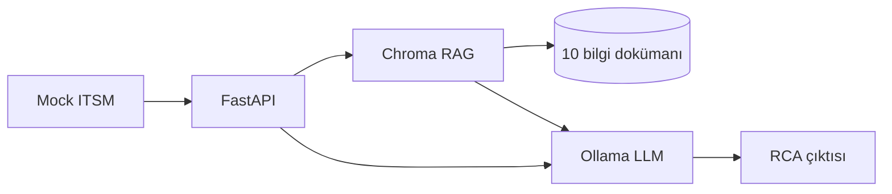

# Mimari ve teknik tasarım

## Özet akış

1. **ITSM / MCP katmanı:** Mock veri `app/itsm_connector.py` içindedir. Aynı veri, isteğe bağlı **stdio MCP sunucusu** (`python -m mcp_server`, araçlar `itsm_list_tickets` / `itsm_get_ticket`) ile de sunulur. FastAPI hâlâ REST ile `GET /tickets` vb. sağlar. Üretimde ServiceNow/Jira bu araçların arkasına bağlanır.
2. **Veri:** Bilet metni API’ye gelir.
3. **RAG:** `knowledge/` altındaki 10 doküman parçalanır, Ollama embedding ile Chroma’ya yazılır; sorgu ile benzer parçalar çekilir.
4. **Agent:** Önce basit sınıflandırma (anahtar kelime), sonra RAG bağlamı + bilet ile prompt oluşturulur.
5. **Offline LLM:** Ollama `llama3` (yapılandırılabilir) `api/generate` ile çağrılır.
6. **Çıktı:** Root Cause / Reason / Solution başlıklarıyla metin döner.

## Teknik kararlar

| Karar | Gerekçe |
|--------|---------|
| **Ollama** | Kurumsal dışına veri çıkarmadan yerel LLM; basit HTTP API; Docker ile kolay |
| **RAG** | Hallüsinasyonu azaltmak ve kurum içi runbook bilgisini modele bağlamak için |
| **Chroma** | Hafif, dosya tabanlı kalıcılık, LangChain ile iyi entegrasyon |
| **FastAPI** | Hızlı REST yüzeyi, tip güvenliği, `/docs` ile test |

## Veri akışı (adım adım)

1. İstemci `GET /tickets` ile mock kayıtları görür.
2. `POST /analyze/ticket/{id}` ile seçilen bilet alınır.
3. Bilet metnine göre kategori etiketi üretilir; RAG sorgusu zenginleştirilir.
4. En yakın `k` parça bağlama eklenir.
5. Tek bir üretim çağrısı ile RCA metni üretilir.

## Varsayımlar

- Ollama’da `llama3` ve embedding için `nomic-embed-text` modelleri çekilmiş kabul edilir (`ollama pull ...`).
- İlk çalıştırmada Chroma koleksiyonu yoksa indeks otomatik kurulur; `/admin/reindex` bilgi tabanı değişince kullanılır.

## Diagram (draw.io)

Draw.io’da bu blokları sırayla yerleştirmeniz yeterli: ITSM → FastAPI → (Chroma + KB dosyaları) → Ollama → RCA JSON/Markdown.
